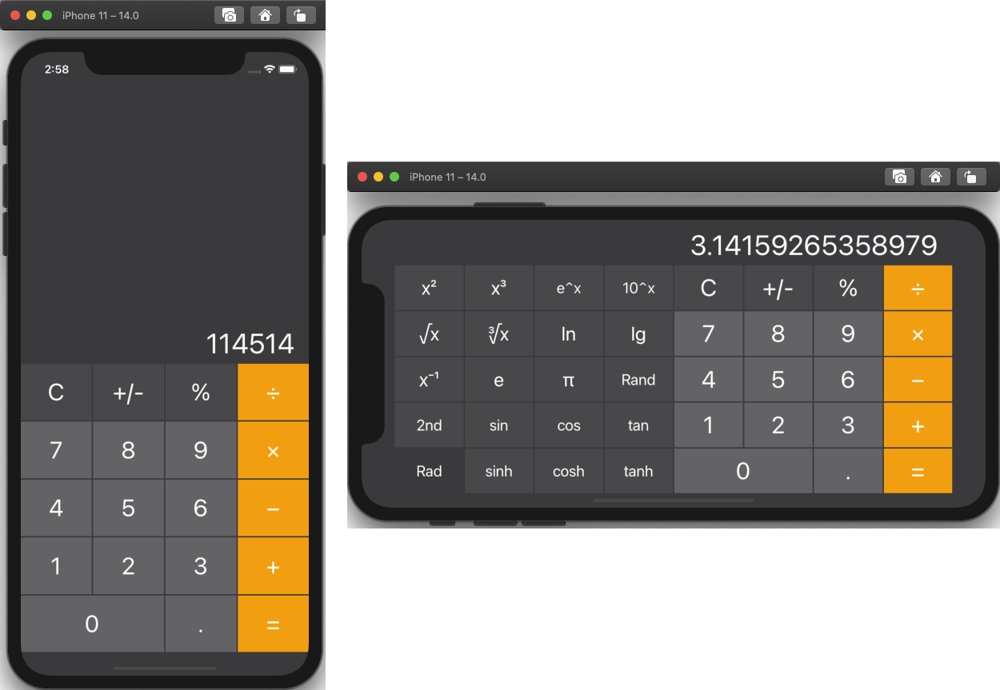

# Calculator

计算器 App，适配各型号iPhone屏幕大小，竖屏时为基本运算，横屏时增加科学型计算功能（iPad设备始终为基本运算）

功能类似于iPhone内置计算器，但做了很多简化
- 不支持括号，以及部分科学运算功能（如mc, m+, m-，x^y）
- 三角函数运算采用弧度制（Rad），不支持切换到角度制

---

模拟器运行（iPhone 11，暗黑模式）：

真机运行（iPod touch 6）：

